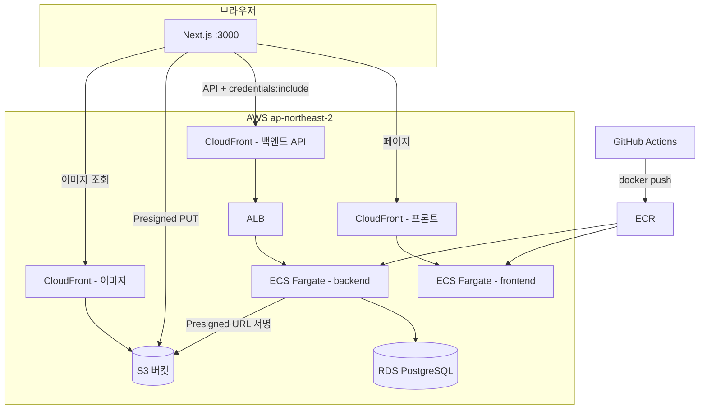

# TodoList

Google 계정으로 로그인해 **나만의 할 일을 관리**하는 웹 서비스. 제목과 완료 여부뿐 아니라 TipTap 리치 텍스트 에디터로 본문(이미지 포함)을 작성·저장할 수 있다. 풀스택·AWS 배포 학습을 겸한 개인 프로젝트.

## 요약

Google OAuth 로그인 + JWT(쿠키) 인증 기반 투두 CRUD 서비스. TipTap 에디터 본문(JSON) + S3 Presigned URL 이미지 업로드. **모노레포**(`frontend` + `backend`), AWS는 **ECS(Fargate) + ECR + RDS + S3 + CloudFront** 구조.

| 영역 | 핵심 |
|------|------|
| Frontend | Next.js 16 (App Router) · TypeScript · Tailwind · RTK Query · TipTap |
| Backend | Spring Boot 4.1 · Java 21 · JPA · JWT + OAuth2(Google) · Gradle |
| DB | PostgreSQL — DB명 `TodoListDB`, 스키마 `todolist_db` |
| Infra | ECR → ECS(Fargate) · RDS · S3(비공개) + CloudFront(OAC) · ALB |
| CI/CD | GitHub Actions — `main` push 시 Docker build → ECR push → ECS 재배포 |

---

## 전체 아키텍처



**이미지 업로드만 예외**: 파일 바이트는 백엔드를 거치지 않고 **프론트 → S3 직접 PUT**. 백엔드는 Presigned URL만 발급.

---

## 디렉토리 구조

```
todolist/
├── frontend/                 # Next.js
│   ├── app/                  # 페이지 (App Router)
│   ├── components/           # UI, TipTapEditor/Viewer
│   ├── lib/api/              # RTK Query, API 호출 (컴포넌트에서 fetch 금지)
│   ├── .env.local            # 로컬 (git 제외) — cp .env.example .env.local
│   └── scripts/docker-deploy.sh
├── backend/                  # Spring Boot
│   ├── src/main/java/com/todolist/
│   │   ├── auth/             # OAuth, JWT, refresh/logout
│   │   ├── user/
│   │   ├── todo/
│   │   ├── file/             # Presigned URL
│   │   ├── common/           # ApiResponse, 예외 처리
│   │   └── config/           # Security, JWT, S3, CORS
│   ├── .env                  # 로컬 (git 제외) — DB, JWT, OAuth, AWS
│   └── scripts/docker-deploy.sh
├── docs/
│   ├── db/init.sql           # ★ DB 스키마 초기화 (ddl-auto: validate → 수동 실행 필수)
│   └── 기획서/개발/          # 상세 기획·인프라·CI/CD 문서
├── .github/workflows/        # frontend-deploy.yml, backend-deploy.yml
└── .cursor/rules/            # AI 코딩 규칙 (common/backend/frontend)
```

---

## DB

| 항목 | 값 |
|------|-----|
| DB명 | `TodoListDB` |
| 스키마 | `todolist_db` |
| 초기화 | `docs/db/init.sql` (JPA `ddl-auto: validate` — **자동 테이블 생성 안 함**) |
| JDBC URL 패턴 | `jdbc:postgresql://{host}:5432/TodoListDB?currentSchema=todolist_db` |

### 테이블

| 테이블 | 핵심 컬럼 |
|--------|-----------|
| `users` | email, nickname, provider(google), provider_id, refresh_token |
| `todos` | user_id(FK), title, content(TipTap JSON 문자열), is_completed |

---

## Backend

### 패키지 역할

| 패키지 | 역할 |
|--------|------|
| `auth` | Google OAuth 시작, refresh, logout |
| `config` | SecurityFilterChain, JWT 필터, OAuth2SuccessHandler, S3Presigner |
| `todo` | CRUD + 완료 토글 |
| `file` | `POST /api/files/presigned-url` |
| `common` | `{ success, message, data }` 공통 응답 |

### API 목록

| Method | URL | 인증 | 설명 |
|--------|-----|------|------|
| GET | `/health` | X | 헬스체크 (ECS/ALB용) |
| GET | `/api/auth/google` | X | Google OAuth 시작 (브라우저 redirect) |
| POST | `/api/auth/refresh` | 쿠키 | Access Token 재발급 |
| POST | `/api/auth/logout` | 쿠키 | 로그아웃 |
| GET | `/api/users/me` | O | 내 정보 |
| GET/POST | `/api/todos` | O | 목록 / 생성 |
| GET/PUT/DELETE | `/api/todos/{id}` | O | 상세 / 수정 / 삭제 |
| PATCH | `/api/todos/{id}/complete` | O | 완료 토글 |
| POST | `/api/files/presigned-url` | O | S3 업로드 URL 발급 |

### 인증 흐름 (꼭 기억)

```
1. 프론트: window.location → GET /api/auth/google
2. Google 로그인 → /login/oauth2/code/google (Spring Security)
3. OAuth2SuccessHandler: JWT를 httpOnly 쿠키(access_token, refresh_token) 설정
4. FRONTEND_URL(예: localhost:3000)로 redirect
5. 이후 API: JwtAuthenticationFilter가 쿠키 검증
```

- Access 30분 / Refresh 7일 — **둘 다 httpOnly 쿠키**, localStorage 사용 안 함
- Refresh Token은 DB `users.refresh_token`에도 저장 (재발급 시 대조)
- 카카오 로그인: UI 아이콘만 있고 **백엔드 미구현** (의도적 제외)

### 환경변수 (`backend/.env`)

`backend/.env.example` 복사 후 채우기.

| 변수 | 용도 |
|------|------|
| `DB_*` | PostgreSQL 연결 |
| `JWT_SECRET` | 32자 이상 |
| `GOOGLE_CLIENT_ID/SECRET` | Google Cloud Console |
| `OAUTH_REDIRECT_URI` | Google Console 승인 URI와 **완전 일치** (로컬: `http://localhost:8080/login/oauth2/code/google`) |
| `FRONTEND_URL` | CORS + OAuth 성공 redirect |
| `COOKIE_SECURE` | 로컬 `false`, prod `true` |
| `AWS_*` | S3 Presigned URL 서명용 |

`.env` 로드: `application.yml`의 `spring.config.import` — **`backend/` 디렉터리에서 실행**하거나 monorepo 루트에서 `./backend/.env` 경로 사용.

---

## Frontend

### 페이지 라우트

| 경로 | 설명 |
|------|------|
| `/` | 랜딩 |
| `/login` | Google 로그인 버튼 |
| `/todos` | 투두 목록 |
| `/todos/new` | 작성 |
| `/todos/[id]` | 상세 |
| `/todos/[id]/edit` | 수정 |

### 핵심 규칙

- API 호출: **`lib/api/`만** (RTK Query + `baseQueryWithReauth`)
- 모든 fetch: `credentials: 'include'` (쿠키 동봉)
- TipTap 본문: **HTML 아님 → JSON** (`editor.getJSON()` → stringify)
- 이미지: 에디터 삽입 시 blob URL만, **저장 버튼 누를 때** Presigned URL로 S3 일괄 업로드 후 JSON 내 URL 치환

### 환경변수 (`frontend/.env.local`)

`frontend/.env.example` 복사 후 사용 (`cp .env.example .env.local`).

> `NEXT_PUBLIC_*`는 **빌드 타임** 번들 포함. prod Docker/CI 빌드 시 `--build-arg`로 주입.

---

## Infra (AWS)

> 상세·실제 리소스명: `docs/기획서/개발/03_인프라-2.md`

| 리소스 | 용도 | 비고 |
|--------|------|------|
| S3 `todolist-e2e-bom-2026` | TipTap 이미지 저장 | 퍼블릭 차단, CORS에 프론트 origin |
| CloudFront `todolist-images` | 이미지 CDN + S3 OAC | `d3ikateoh29d3y.cloudfront.net` |
| IAM `todolist-s3-uploader` | Presigned URL 서명 | Put/Get/Delete만, 버킷 한정 |
| RDS | PostgreSQL | 학습용 퍼블릭 액세스 허용 가능 |
| ECR | `todolist-frontend`, `todolist-backend` | |
| ECS Fargate | 프론트/백 서비스 | ALB는 서비스 생성 마법사에서 함께 |
| CloudFront (API) | 백엔드 공개 URL | OAuth redirect_uri, `NEXT_PUBLIC_API_URL` |

**안 쓰는 것**: EC2, Elastic Beanstalk, Amplify (ECS+Docker 회사 구조에 맞춤)

**Terraform**: `.gitignore`에 경로만 있고 **아직 코드 없음** — 콘솔 수동 구성, 추후 IaC화 예정.

---

## 로컬 실행

### 사전 준비

| 도구 | 버전 |
|------|------|
| Java | 21 |
| Node.js | 20+ |
| PostgreSQL | 14+ |
| (선택) Docker, AWS CLI | 배포·이미지 테스트용 |

### 1. PostgreSQL

```bash
# DB 생성 (psql 또는 pgAdmin)
CREATE DATABASE "TodoListDB";

# 스키마·테이블 생성
psql -U postgres -d TodoListDB -f docs/db/init.sql
```

### 2. 환경변수

```bash
cp backend/.env.example backend/.env      # DB, JWT, Google OAuth, AWS 값 입력
cp frontend/.env.example frontend/.env.local
```

**Google OAuth (로컬)** — Google Cloud Console:

- 승인된 리디렉션 URI: `http://localhost:8080/login/oauth2/code/google`
- `backend/.env`의 `OAUTH_REDIRECT_URI`와 동일해야 함

**S3 이미지 테스트** — AWS 키·버킷·CloudFront 도메인 필요. S3 CORS에 `http://localhost:3000` 포함 확인.

### 3. 실행

```bash
# 터미널 1 — 백엔드 (backend/ 에서)
cd backend
./gradlew bootRun

# 터미널 2 — 프론트
cd frontend
npm install
npm run dev
```

| 서비스 | URL |
|--------|-----|
| Frontend | http://localhost:3000 |
| Backend | http://localhost:8080 |
| Health | http://localhost:8080/health |

### 4. 로컬 E2E 확인 순서

1. `/health` → 200
2. `/login` → Google 로그인 → `/todos` redirect
3. 투두 작성·수정·삭제·완료 토글
4. 에디터 이미지 첨부 → 저장 → CloudFront URL로 표시

### 5. 백엔드 단위 테스트

```bash
cd backend
./gradlew test    # H2 in-memory (PostgreSQL 불필요)
```

### 6. 프론트 lint

```bash
cd frontend
npm run lint
```

---

## 배포 (prod)

### 흐름

```
main push
  → GitHub Actions (path filter: frontend/** 또는 backend/**)
  → docker build --platform linux/amd64
  → ECR push (:latest)
  → aws ecs update-service --force-new-deployment
```

### GitHub Actions 설정

| 종류 | 이름 |
|------|------|
| Secrets | `AWS_ACCESS_KEY_ID`, `AWS_SECRET_ACCESS_KEY` |
| Variables | `AWS_REGION`, `ECS_CLUSTER`, `ECS_SERVICE_FRONTEND/BACKEND`, `ECR_REPOSITORY_*`, `NEXT_PUBLIC_API_URL` |

> `NEXT_PUBLIC_API_URL` = **백엔드 CloudFront HTTPS URL** (ALB 직접 X, 끝 `/` 없음)

### ECS Task Definition (백엔드 런타임 env)

Docker 빌드 arg 없음 — **Task Definition**에서 주입:

- `DB_*`, `JWT_SECRET`, `GOOGLE_*`, `OAUTH_REDIRECT_URI`(prod CloudFront + `/login/oauth2/code/google`)
- `FRONTEND_URL`, `COOKIE_SECURE=true`, `AWS_*`

### 수동 배포 (긴급·디버그)

```bash
cp backend/.env.deploy.example backend/.env.deploy   # AWS_ACCOUNT_ID 등
cp frontend/.env.deploy.example frontend/.env.deploy # NEXT_PUBLIC_API_URL

./backend/scripts/docker-deploy.sh --push
./frontend/scripts/docker-deploy.sh --push
# 이후 ECS 콘솔 Force new deployment
```

상세: `docs/기획서/개발/04_GitHub-Actions-CICD.md`

---

## 자주 헷갈리는 것 / 트러블슈팅

| 증상 | 원인 / 해결 |
|------|-------------|
| `Schema-validation: missing table` | `init.sql` 미실행. PostgreSQL에 스키마 먼저 생성 |
| Google `redirect_uri_mismatch` | `OAUTH_REDIRECT_URI` ↔ Google Console ↔ prod CloudFront URL 불일치 |
| API 401 + HTML redirect | API 경로는 `JwtAuthenticationEntryPoint`가 JSON 401 반환 — 쿠키 만료 시 refresh 흐름 확인 |
| CORS 에러 | `FRONTEND_URL` / `cors.allowed-origins`에 프론트 origin 등록 |
| Presigned URL 403 | IAM 권한, 버킷명, 리전 불일치 |
| S3 PUT CORS | S3 버킷 CORS에 프론트 origin + PUT/GET |
| `.env` 변경 반영 안 됨 | 백엔드 **재시작** 필요 (런타임 로드) |
| 프론트 API URL 안 바뀜 | `NEXT_PUBLIC_*`는 **재빌드** 필요 (Task env만 변경 X) |
| ECS 배포 롤백 | Health check grace period 120~180초, `/health` Target Group 확인 |
| ECR push 후 앱 그대로 | `force-new-deployment` 누락 |

---

## 핵심 설계 결정 (왜 이렇게 했는지)

| 결정 | 이유 |
|------|------|
| JWT → httpOnly 쿠키 | XSS로 토큰 탈취 방지 |
| TipTap JSON 저장 | HTML 변환 손실 없음, blob URL 치환 단순 |
| 게시 시점 이미지 업로드 | 작성 중 이탈 시 S3 고아 파일 방지 |
| S3 비공개 + CloudFront OAC | 직접 URL 노출·비용 남용 방지 |
| Presigned URL | 백엔드가 파일 바이트 안 받음 → 부하·용량 절감 |
| ECS + Docker | 회사(deepez) 배포 구조와 동일하게 학습 |
| ddl-auto validate | DB는 `init.sql`로 명시 관리 |

---

## 상세 문서 (더 깊게 볼 때)

| 문서 | 내용 |
|------|------|
| `docs/기획서/개발/00_개요-2.md` | 프로젝트 목적, 개발 순서 |
| `docs/기획서/개발/01_프론트엔드.md` | TipTap, 이미지 업로드, RTK Query |
| `docs/기획서/개발/02_백엔드.md` | 인증, API, S3 연동 |
| `docs/기획서/개발/03_인프라-2.md` | S3/IAM/CloudFront/RDS/ECS |
| `docs/기획서/개발/04_GitHub-Actions-CICD.md` | CI/CD, Secrets/Variables |
| `.cursor/rules/*.mdc` | AI·코딩 컨벤션 |

---

## 미완 / 다음에 할 일

- [ ] Terraform IaC 코드화
- [ ] GitHub Actions OIDC (Access Key 대신 IAM Role)
- [ ] Docker 이미지 태그 `:latest` → git SHA
- [ ] prod S3 CORS·CloudFront에 실제 프론트 도메인 추가
- [ ] CloudFront(프론트) 연결 (시간 부족 시 ALB 직접 접속으로 1차 완료 가능)
- [ ] 카카오 로그인 (현재 미구현)

---

## 빠른 명령어 치트시트

```bash
# 로컬
cd backend && ./gradlew bootRun
cd frontend && npm run dev
cd backend && ./gradlew test

# Docker 로컬 빌드만
cd backend && ./scripts/docker-deploy.sh
cd frontend && ./scripts/docker-deploy.sh

# DB 재초기화 (주의: 데이터 삭제)
psql -U postgres -d TodoListDB -f docs/db/init.sql
```
